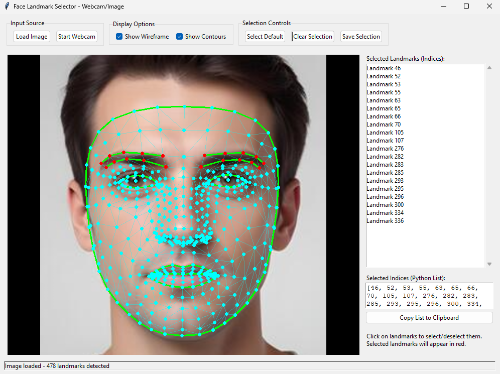

# MediaPipe Face Landmark Selection Tool

[](https://opensource.org/licenses/MIT)

This tool was born out of the repetitive need to consult facial landmark diagrams and manually input indices into code. If you've faced similar issue, this might be what you're looking for. It offers an intuitive way to:

Visualize detailed facial landmarks on static images or a live webcam stream.
Interactively select the specific landmarks you require.
Effortlessly export the selected indices – simply copy the generated Python list or save the full selection. This aims to save you time and make working with facial landmark data more efficient."




## Features

* **Multiple Input Sources:**
    * Load images (JPEG, PNG, BMP, TIFF).
    * Use live webcam feed.
* **Facial Landmark Detection:**
    * Utilizes MediaPipe Face Mesh for accurate and comprehensive landmark detection (478 landmarks).
* **Interactive Landmark Selection:**
    * Click on landmarks directly on the image/video frame to select or deselect them.
    * Selected landmarks are highlighted in a different color (red).
* **Visualization Options:**
    * Toggle display of the full face mesh (tesselation).
    * Toggle display of facial contours.
* **Landmark Index Management:**
    * View a list of selected landmark indices.
    * Display selected indices as a Python list.
    * Copy the Python list of selected indices to the clipboard.
    * Save the selected landmark indices to a `.txt` file (includes list format and comma-separated values).
    * Load a predefined set of default landmark indices.
    * Clear the current selection.
* **User-Friendly Interface:**
    * Built with Tkinter for a simple graphical user interface.
    * Status bar for feedback and error messages.
* **Resizable Interface:** The main window can be resized.

## Packages Used

* **Python 3.x**
* **OpenCV (`cv2`):** For image and video processing.
* **MediaPipe (`mediapipe`):** For facial landmark detection (Face Mesh).
* **Tkinter (`tkinter`):** For the graphical user interface.
* **Pillow (`PIL`):** For handling image formats within Tkinter.
* **NumPy (`numpy`):** For numerical operations (often a dependency of OpenCV/MediaPipe).

## Prerequisites

* Python 3.7 or higher.
* `pip` (Python package installer).

## Installation

1.  **Clone the repository (or download the script):**
    ```bash
    git clone [https://github.com/your-username/Interactive-Face-Landmark-Selector.git](https://github.com/your-username/Interactive-Face-Landmark-Selector.git)
    cd Interactive-Face-Landmark-Selector
    ```

2.  **Create a virtual environment (recommended):**
    ```bash
    python -m venv venv
    # On Windows
    venv\Scripts\activate
    # On macOS/Linux
    source venv/bin/activate
    ```

3.  **Install the required libraries:**
    Create a `requirements.txt` file with the following content:
    ```txt
    opencv-python
    mediapipe
    Pillow
    numpy
    ```
    Then run:
    ```bash
    pip install -r requirements.txt
    ```

## Usage

Run the application script from your terminal:

```bash
python mp_face_landmark_selector.py
